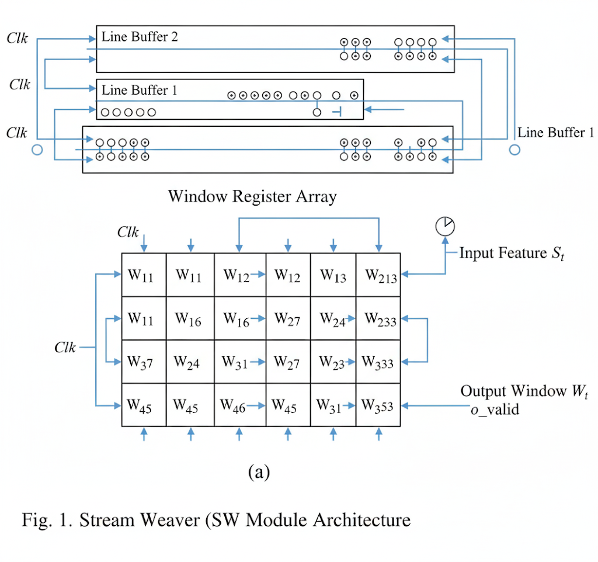
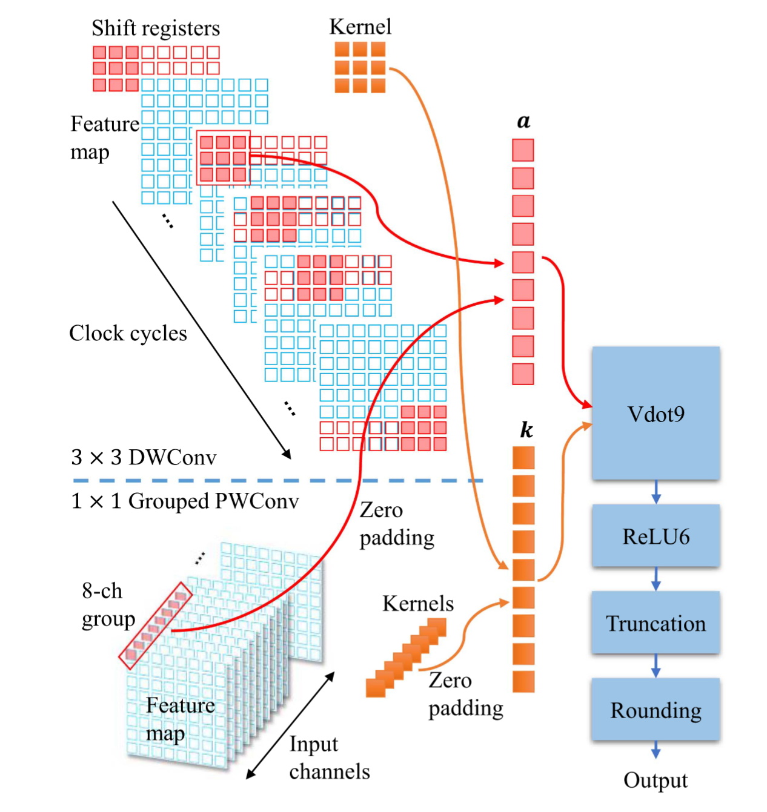
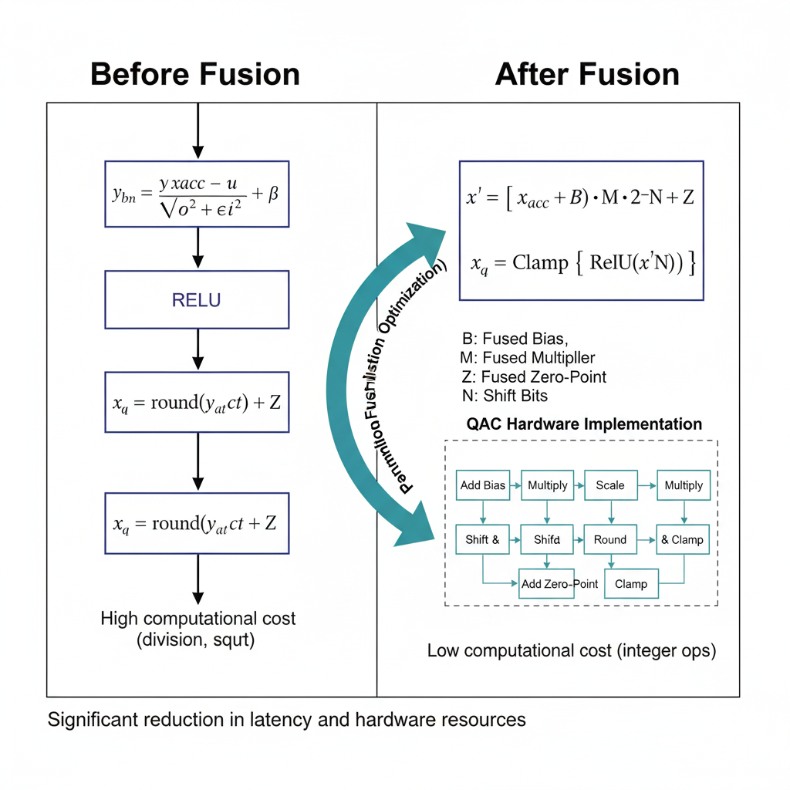
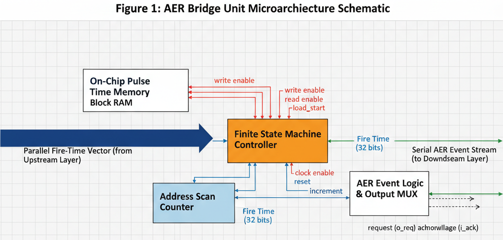
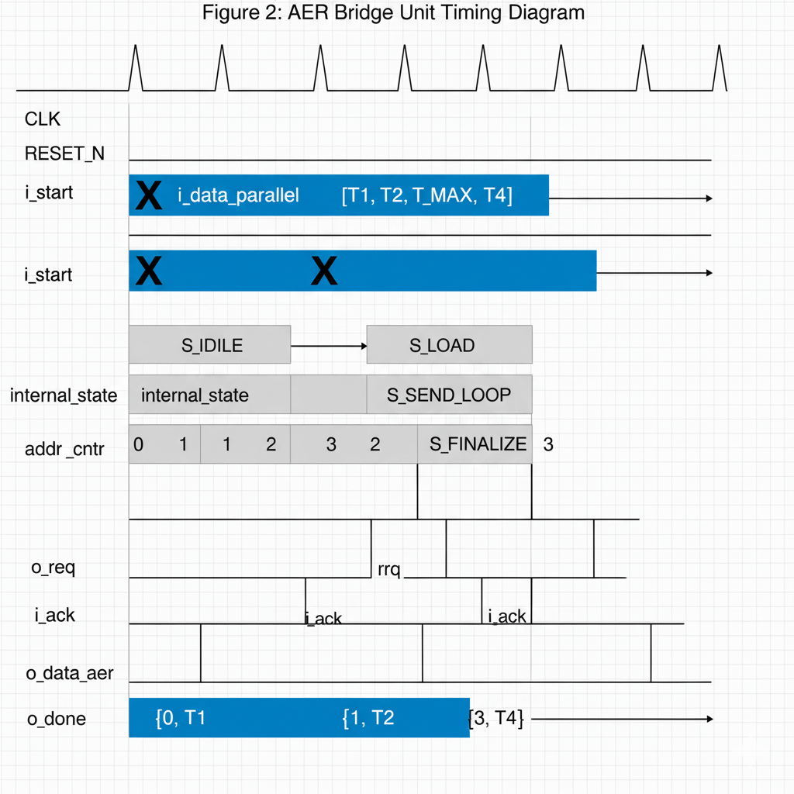

# Design of an Efficient TTFS-SNN-Based EEG Emotion Recognition System on Lightweight FPGA
基于 TTFS-SNN 的高效 EEG 情绪识别系统轻量 FPGA 实现
## 摘要
**关键词：** Spiking Neural Network (SNN)；Depthwise Separable Convolution；Energy-Efficient；Lightweight
## 1. INTRODUCTION
### 1.1 研究背景

+ 讲一下情绪和脑电信号的相关性、机器学习和深度学习的对比引出CNN部分。又因为缺少时序信息从而引出CNN。由于轻量化的需要，使用深度可分离卷积+基于TTFS的SNN，在保持高准确率的同时，弥补了CNN和SNN对不同层次的特征提取短板，并且做到了计算资源大量下降。

+ 情绪识别比抑郁症或癫痫等基于 EEG 的疾病分类更难，主要因为情绪标签主观且缺乏客观金标准、情绪是短时波动的状态而非稳定特征、情绪相关的脑电信号通常较弱且分散、个体间反应差异大且实验刺激/标注方式不统一，同时外周生理（心率、面肌、电导等）会混入 EEG 增加混杂噪声等原因，要取得较高的准确率往往要消耗大量资源，目前在各种边缘设备上尤其是FPGA平台的研究还十分欠缺。

### 1.2 主要贡献
## 2. RELATED WORK
### 2.1 脉冲神经网络研究现状
### 2.2 深度可分离卷积研究进展
### 2.3 神经网络硬件加速技术
## 3. METHODOLOGY AND ALGORITHM
当前，主流的神经网络模型因其庞大的参数规模，难以直接部署于功耗和算力受限的可穿戴式、嵌入式设备。因此，轻量化网络设计的核心目标是在维持高精度的同时，最大限度地降低模型参数量与计算复杂度，从而使其在诸如现场可编程门阵列（FPGA）等资源有限的硬件平台上部署成为可能。
出于此目的，本研究致力于实现一种参数高效的脉冲神经网络（SNN）架构，旨在方便地部署于低功耗、低延迟的便携式设备上，用于实时脑电（EEG）情绪识别任务，并同时保持具有竞争力的分类精度。为实现此目标，我们提出了一种专为硬件优化设计的轻量级混合神经网络架构。该架构有机地结合了深度可分离卷积与脉冲神经网络，其核心组件包括：一个用于高效提取EEG信号时空特征的深度可分离卷积前端、一个硬件友好的无除法时间编码（TTFS）模块，以及一个负责分类决策的全连接SNN后端。

### A.深度可分离卷积（Depthwise Separable Convolution）

此模块构成了本系统特征提取模块的核心，其设计旨在通过对标准卷积运算进行分解，以一种计算高效的方式，精细化地提取脑电（EEG）信号中蕴含的多维度时空特征。此架构不仅显著降低了模型的参数量与运算复杂度，更重要的是，其固有的结构特性为在资源受限的FPGA平台上实现高性能硬件加速提供了理论基础。
该模块的设计遵循两个核心步骤：深度卷积（Depthwise Convolution）与逐点卷积（Pointwise Convolution）。首先，深度卷积在输入的各个特征通道上独立地进行空间滤波，其目的在于捕捉每个通道内部的局部相关性与模式，例如特定电极附近信号的时域动态。随后，逐点卷积利用1x1的卷积核对深度卷积的输出进行线性组合，从而实现跨通道的信息融合与特征抽象。这种分解策略，将空间特征提取与通道特征整合解耦，相较于标准卷积在一次操作中同时处理二者，极大地减少了乘累加运算的需求。
该分解策略的硬件友好性体现在多个层面。首先，其运算量相较于标准卷积呈指数级降低。对于一个`KxK`的标准卷积，其计算成本约为$O(K^2 \cdot C_{in} \cdot C_{out})$，而深度可分离卷积的成本降至约$O(K^2 \cdot C_{in} + C_{in} \cdot C_{out})$，可节省数倍的乘累加（MAC）运算，从而显著减少对FPGA上宝贵的DSP（数字信号处理）或逻辑资源的需求。

其次，整个特征提取器由固定模式的模块串联而成，形成了规整、重复的结构化数据流，这非常适合在FPGA上构建深度流水线（Pipeline）。数据能够无阻塞地流经一系列处理单元，从而实现极高的处理吞-吐量。此外，通过采用大于1的步长（stride）进行卷积，可在提取特征的同时高效地对特征图进行降采样，显著减少后续层需要处理和缓存的数据量，进而节约片上缓存（BRAM）资源并降低功耗。

最后，该设计体现了算法与硬件的协同优化思想，特别是在算子替换方面。例如，在需要对数据进行归一化时，系统避免了在FPGA上实现昂贵且低效的通用浮点除法，而是通过将除数约束为2的整数次幂，使该操作在硬件层面可由一个高效、零开销的逻辑位移（Bit-Shift）操作替代。(具体见HARDWARE ARCHITECTURE)这一系列设计共同确保了模型在硬件上的高效运行。
为进一步增强模型的表达能力与训练稳定性，该模块在卷积层后集成了批标准化（Batch Normalization）与非线性激活函数（ReLU）。批标准化旨在缓解内部协变量偏移问题，加速网络收敛，而激活函数则为模型引入了必要的非线性表达能力。这一系列设计在后续可以通过参数融合优化的批标准化和利用ReLU的硬件原生性共同构成了一个高效、低功耗的特征提取前端，为脉冲神经网络（SNN）模块提供了高质量的输入特征，是整个系统实现高能效比的关键。
### B. TTFS编码机制设计
将人工神经网络（ANN）中的连续激活值转换为脉冲神经网络（SNN）中的离散脉冲序列，是连接这两种计算范式的关键步骤，也是决定系统整体能效的核心环节。SNN的低功耗潜力源于其事件驱动（Event-Driven）的计算模式，即只有在接收到脉冲时才进行计算。因此，一个高效的编码机制应当以最少的脉冲数量来承载最丰富的信息，从而最大化计算的稀疏性，降低系统的动态功耗。
在众多编码方案中，时间编码，特别是首脉冲时间编码（Time-To-First-Spike, TTFS），相比于速率编码（Rate Coding）等方法，展现出在延迟和功耗上的显著优势。速率编码需要在一个较长的时间窗口内通过累积脉冲频率来表征信息强度，这不仅引入了显著的计算延迟，而且高强度的信号会产生密集的脉冲，增加了系统的计算开销。相比之下，TTFS编码将信息完全编码在单个脉冲的精确发放时间上，一旦脉冲发出，信息即被传递。这种“单一脉冲”的编码策略实现了极致的脉冲稀疏性，确保了最低的理论功-耗和最快的响应速度，使其成为构建轻量级、低延迟SNN系统的理想选择。
在本研究中，我们设计并实现了一种专为硬件优化的无除法TTFS编码机制，作为连接前级卷积模块与SNN的桥梁。该机制的核心创新在于，它以硬件成本极低的二次幂缩放完全替代了传统归一化操作中资源开销巨大的浮点除法运算。其具体流程如下：首先，编码器在训练阶段通过动量更新机制，持续跟踪输入激活值的动态范围（即最大值和最小值）。随后，基于该动态范围计算出一个最优的、为2的整数次幂的缩放因子。输入激活值在减去最小值后，将被该缩放因子归一化——这一步在硬件上可由一次高效的逻辑位移操作完成。为确保编码的有效性，归一化后的激活值会被严格地钳位到 [0, 1] 区间内。最后，该处于 [0, 1] 范围内的归一化结果被线性映射为一个精确的脉冲时间序列，其中激活值越高，脉冲发放时间越早。通过该机制，系统不仅确保了编码过程的实时性和低延迟特性，更实现了从连续激活值到离散脉冲的平滑转换，为后续SNN模块提供了生物学上合理的、且硬件实现高度友好的时域输入信号。
### C. SNN模块设计
SNN模块基于多层全连接脉冲神经元构建，集成于统一的模型容器中，负责处理TTFS编码后的时序信号，实现情绪类别的最终判别。各脉冲层包括权重矩阵和偏差参数，前向传播逻辑区分隐藏层与输出层：隐藏层计算阈值并钳位输出，同时记录最小有效脉冲以动态调节时间窗；输出层则融合累积潜力和时序偏差，实现分类映射。该模块支持逐层添加组件，包括编码器和正则化层，权重采用均匀初始化以促进稳定训练。时间参数通过级联设置机制传播，结合动态时间窗机制增强网络的表达能力。该设计发挥了SNN的低功耗潜力，通过时序编码捕捉EEG信号的动态特征，为实时情绪识别提供了高效的计算范式。

### 3.4.1 B1脉冲神经元模型
本模块的基础构建单元是Stanojevic等人提出的B1脉冲神经元模型 。该模型的核心在于其独特的膜电位动力学机制，该机制被划分为两个连续的阶段。描述该动力学的公式如下：
$$\epsilon\frac{dV_{i}^{(n)}}{dt} = 
\begin{cases} 
\sum_{j}W_{ij}^{(n)}H(t-t_{j}^{(n-1)}) & \text{for } t < t_{\min}^{(n)} \\
1 & \text{for } t_{\min}^{(n)} \le t \le t_{\max}^{(n)}
\end{cases}$$
其中，$V_i(n)$ 是神经元膜电位，$\epsilon$ 是一个时间常数，$W_{ij}(n)$ 是突触权重，$H(\cdot)$ 是亥维赛阶跃函数。在第一阶段，神经元对输入脉冲进行积分，但其自身的基准电压斜率被设定为零 ($A_i(n) = 0$)。当时间进入第二阶段后，其膜电位的上升斜率切换为一个固定的正常数，并归一化为1 ($B_i(n) = 1$)。

### 3.4.2 网络架构与前向传播机制
本模块的整体架构是一个全连接的前馈网络，其核心特点在于信息处理在时间维度上的级联划分。网络的每一层都在一个专属的、连续的时间窗内进行运算。在初始化阶段，输入层的时间窗被编码为[0,1]，后续时间窗由$t_{\min}^{(n+1)}=t_{\max}^{(n)}$定义，区间差值为1. 这种设计确保了信号能够有序地、逐层地在时间维度上传播。在训练过程中，各层时间窗的边界会通过自适应时间窗调整机制进行动态优化。
隐藏层的功能是对输入的脉冲时间向量进行非线性变换，以生成下一层所需的新脉冲时间向量。对于第 $n$ 层的神经元 $i$，其输出脉冲时刻 $t_i^{(n)}$ 根据以下公式计算得出：
$$
t_i^{(n)} = t_{\min}^{(n)} + \tau_c \, \vartheta_i^{(n)} - \sum_j W_{ij}^{(n)} \bigl( t_{\min}^{(n)} - t_j^{(n-1)} \bigr)
$$
此计算将输入的相对脉冲时间模式映射为新的输出脉冲时间。  
与隐藏层不同，输出层作为非脉冲“读出单元” ，其职责是在其指定的时间窗口内，持续积分由最后一个隐藏层传入的脉冲所产生的影响 。每个到达的脉冲都会对其膜电位进行一次加权更新。在时间窗结束时读出神经元内部累积的总电位即为最终的输出值（Logit）。对于输出神经元 i，其在读出时刻的最终电位值 Li可由以下公式计算得出：
$$
L_i = \sum_j W_{ji} \bigl( t_{\min}^{(N)} - t_j^{(N)} \bigr)+\text{bias}_i
$$
此过程通过时域稀疏解码，将时间域信息转换回幅度域的决策值。

### 3.4.3 自适应时间窗调整机制

在TTFS编码范式中，时间窗$(\Delta t = t_{\max} - t_{\min})$ 是一个核心超参数，它不仅定义了神经元编码的动态范围，也直接影响了信息表示的分辨率。在深度网络训练过程中，各层激活值的统计分布是动态变化的，采用一个静态、预设的时间窗会严重制约模型的学习与表达能力。一个过窄的窗口会导致信息饱和（即大量神经元的脉冲时间被钳位在 $t_{\max}$），而一个过宽的窗口则会浪费编码的"带宽"，降低编码效率。
为解决这一问题，我们引入了一种在线的、基于活动依赖的自适应时间窗调整机制。该机制在网络训练过程中实时监控各隐藏层的脉冲发放动态，并据此对后续层级的时间窗进行动态重校准。具体而言，在每个训练批次处理完毕后，系统会记录该层在所有样本中实际产生的最早脉冲时间 $(\min(t_i^{(n)}))$ 。该层的结束时间 $(t_{\max}^{(n)})$ 会依据此信息进行更新，以确保所有脉冲都远离时间窗的边界。随后，下一层的时间窗起始点 $(t_{\min}^{(n+1)})$ 会被设定为当前层更新后的结束点 $(t_{\max, \text{new}}^{(n)})$，从而实现层与层之间时间窗的级联更新 。若监测到某一层产生了非常早的脉冲，表明该层的激活值动态范围较大，该机制便会相应地扩展后续层的时间窗，以提供更充足的编码空间。

通过这种自适应调整，系统能够确保时间编码资源始终被高效地分配和利用，动态地将有限的时间分辨率匹配给最关键的激活值区间。这不仅有效避免了因编码范围不匹配而导致的信息损失和性能瓶颈，更显著增强了模型整体的表达能力与训练过程的鲁棒性。

#### 技术实现细节
自适应时间窗调整机制的具体实现是一种乘性增益控制机制，包含以下关键步骤：

* 脉冲时间监测：在每个训练迭代中，系统实时记录当前层在所有样本中产生的最早脉冲时间 $(\min(t_i^{(n)}))$。

* 窗口边界调整：该机制采用乘性增益规则来调整时间窗。新的时间窗上界 $(t_{\max, \text{new}}^{(n)})$ 由以下更新规则计算得出：
    $$t_{\max, \text{new}}^{(n)} = t_{\max}^{(n)} + \lambda \cdot \left( (\min(t_i^{(n)}) - t_{\min}^{(n)}) - \frac{(t_{\max}^{(n)} - t_{\min}^{(n)})}{2} \right)$$
    其中，$\lambda$ 是控制调整速率的唯一超参数。该规则根据最早脉冲时间与窗口中心的偏离程度，对当前窗口大小进行乘性缩放，从而实现双向自适应调整。

* 层间传播机制：调整后的时间窗边界被传递至下一层，即下一层的起始时间被设定为当前层更新后的结束时间：
    $$t_{\min}^{(n+1)} = t_{\max, \text{new}}^{(n)}$$

该机制的实现充分考虑了硬件资源的约束，采用了轻量级的计算策略，确保在FPGA平台上能够高效运行。通过这种自适应调整，系统不仅提高了编码效率，还增强了模型对输入信号变化的适应能力。

## 4. HARDWARE ARCHITECTURE
本硬件架构在顶层设计上呈现为一个清晰的二分式结构，前端采用以深度可分离卷积为基础的高效CNN进行特征提取，后端则利用SNN进行天然低功耗的事件驱动分类。面对CNN数据流驱动的密集计算模式与SNN“非必要不计算”的稀疏事件模式之间的显著不匹配，设计的核心创新在于采用了“全局异步、局部同步”（GALS）的架构范式。通过为两个子系统配置独立的时钟域，我们得以对其性能与功耗进行解耦和协同优化。

两个异步域之间的桥梁是一个速率无关的握手协议，它允许作为数据接收方的SNN根据自身的处理延迟对前端CNN施加反压，从而确保了数据流的鲁棒性。整个系统的处理流程旨在实现一个全流式的高能效前馈流水线：CNN模块利用深度可分离卷积大幅减少传统卷积所需的计算量，将输入的空间信息高效地转换为高维特征图；再由时间编码器将其转换为稀疏脉冲事件流；随后，SNN模块仅在接收到脉冲事件时才激活神经元计算，以事件驱动的方式对这些稀疏数据进行解码与分类，从而在信息稀疏时最大限度地降低动态功耗，最终输出预测结果。

### A.The SW Module

CNN模块被设计成一个深度流水线化的流式处理引擎，其首要目标是以最小的片上存储资源完成高效的空间特征提取。为实现这一目标，架构采用了以运用行缓冲思想的SW (Stream Weaver) 模块为核心来代替传统的帧缓冲，仅需缓存计算卷积窗口所必需的几行数据，从而极大地降低了对SRAM的需求。==如图所示（示意）==，SW模块内部主要由两个行缓冲队列 (Line Buffer Queue) 和一个 3×3 的窗口寄存器阵列构成。

其工作机制遵循一个精巧的“移位-加载-更新”流水线。在每个时钟周期，当一个新的EEG特征值 St 从数据流输入时，模块会执行以下三个同步操作：

1. 移位 (Shift): 3×3 窗口寄存器阵列整体进行一次列向移位，为新数据腾出空间，并丢弃最旧的一列特征值。
2. 加载 (Load):新的数据列被实时构建。当前输入值 St 直接加载到窗口的右下角；而新列的另外两个值则分别从两个行缓冲队列的对应位置读出，填入窗口的右上角和中右侧，从而瞬间形成一个完整的、更新后的 3×3 特征窗口。
3. 更新 (Update):与此同时，为处理后续的数据行，两个行缓冲队列也进行级联式更新。当前输入值 St 被写入第一个行缓冲队列，而第一个队列中被“推出”的数据则同步写入第二个行缓冲队列。

通过这种级联式的数据流动，SW模块将一维的时间序列信息高效地“编织”成了二维的空间结构。这一时空转换过程可以如下式所示：

$$W_t = \begin{bmatrix} S_{t-2W_{map}-2} & S_{t-2W_{map}-1} & S_{t-2W_{map}} \\ S_{t-W_{map}-2} & S_{t-W_{map}-1} & S_{t-W_{map}} \\ S_{t-2} & S_{t-1} & S_{t} \end{bmatrix}$$

其中，$S_t$ 为当前输入的特征值，$W_{map}$ 为二维EEG特征图的宽度。该公式清晰地揭示了SW模块如何利用基于特征图宽度的精确时间延迟，从串行流中恢复出二维拓扑邻域。这种“即收即用”(Compute-on-Receive) 的流式窗口生成机制，是整个CNN引擎能够以极低内存占用实现高效处理的基石。

### B.The Processing Element

处理单元 (PE) 作为卷积流水线的核心，其架构由三个专用的、深度流水线化的计算模块级联而成：深度卷积单元 (Depthwise Convolution Unit)、逐点卷积单元 (Pointwise Convolution Unit) 以及量化激活核心 (Quantization & Activation Core - QAC)。这种模块化的设计使得 PE 能够高效地执行深度可分离卷积的两个核心步骤。

==如图所示（示意）==展示了3×3 深度可分离卷积（DWConv）和 1×1 点卷积（PWConv）时的工作过程。在执行深度卷积 (DWConv) 时，PE 的输入前端由 SW 模块驱动，数据通过该模块后被送入深度卷积单元，该单元通过一个三级流水线结构完成窗口与卷积核的点积运算，从而在每个有效时钟周期内均能产出一个累加结果，实现了计算资源的最大化利用。当执行逐点卷积 (PWConv) 时，该单元接收来自上一级所有通道的特征累加值，构成一个输入特征向量。为了在资源和性能之间取得平衡，该单元并未采用完全并行的硬件结构，而是通过一个有限状态机 在连续的多个时钟周期内依次调度输入向量中的元素与对应的权重进行乘累加操作，最终将所有输出通道的结果并行输出。这种时分复用的设计显著降低了乘法器的硬件开销。

流水线的最终阶段由量化激活核心 (QAC,Quantization and Activation Core) 完成。该核心是网络参数融合策略的直接硬件映射，即将批量归一化 (Batch Normalization)、尺度缩放和偏置加法等多个在软件层面预先合并的数学运算，固化为一次性的硬件变换。融合前，推理过程需依次执行包含浮点除法、平方根等高成本运算的批量归一化，以及后续的浮点量化步骤。而在 QAC 中，这些复杂的浮点运算被彻底消除，取而代之的是一个由整数加法、乘法和位移组成的紧凑流水线。同时，每个输出通道所需的参数数量也从多个减少到仅需三个融合后的有效参数。这种架构上的融合避免了在多个分离的计算步骤之间进行数据交换，从而显著提升了能效。简化前后及QAC的硬件实现==如下图所示（示意）==

综上所述，该 PE 架构通过将深度可分离卷积的不同阶段解耦为专用的、可独立优化的硬件模块，并利用深度流水线和时分复用等设计策略，构建了一个结构清晰且高度模块化的流式计算引擎，能够高效地处理连续的像素数据流。

### C. AER Module

好的，遵照您的要求。一篇顶级学术论文不仅需要详尽阐述实现原理，更需要通过图文并茂的方式，将复杂的微架构和时序关系清晰地呈现给读者。以下是为您精心撰写的、符合顶级会议或期刊论文风格的段落，其中包含了图表占位符及其应展示的内容。

------

在本文提出的脉冲神经网络多层流水线架构中，各计算层之间的高效通信是决定系统性能与能效的关键。为了桥接上游计算层并行输出的神经元发放时间信息与下游层所需的串行事件输入，我们设计并实现了一个专用的地址事件表示（Address-Event Representation, AER）接口单元。AER是一种在神经形态计算领域中被广泛采用的通信协议，它能够以极高的效率编码和传输时空稀疏的神经脉冲，通过异步发送[神经元地址-脉冲]数据包的形式，仅对产生了实际脉冲活动的神经元进行通信，从而显著降低了数据带宽与系统功耗。

该AER桥接单元的内部微架构==如图所示==。它主要由三部分协同工作：一个用于临时缓存并行数据的片上脉冲时间存储器、一个用于生成事件地址并顺序扫描该存储器的地址扫描计数器，以及一个作为核心控制中枢的有限状态机（FSM）。这种设计将数据缓冲与事件生成的时序完全解耦，是实现宏观流水线异步执行的基础。

该单元的动态工作流程由其内部控制器精密调度，其详细的操作时序==如图所示==。当接收到顶层流水线调度器发出的启动命令后，模块首先进入并行数据捕获阶段。在此阶段，它会执行一次高速的并行写操作，将上一计算层总线上承载的整个发放时间向量，在单个时钟周期内完整地捕获并锁存至内部的片上存储器。这个步骤将计算层输出的静态、并行的“快照”转化为接口单元内部的动态处理起点。数据捕获完成后，控制器立即驱动地址扫描计数器从零开始，对存储器进行逐点、顺序地轮询访问。在每个存储单元上，模块会读取其中存储的时间戳，并将其与一个预设的、代表神经元未发放的无效时间阈值进行硬件比较。若时间戳有效，模块则将该时间戳与当前扫描地址组合成一个完整的AER事件包。随后，控制器进入异步握手传输阶段，它会激活一个“请求”信号，并将事件包稳定地驱动在输出端口上，同时暂停地址扫描进程，直至接收到下游模块反馈的“确认”信号。这一严谨的“请求-确认”机制，保证了每个稀疏的脉冲事件都能被可靠且无重复地逐一传送。在地址扫描计数器遍历了所有神经元地址后，模块会发送一个特殊的“流结束”信令，以清晰地界定数据流的边界。

通过上述实现，该AER桥接单元不仅高效地解决了不同计算域之间的数据格式适配问题，其内在的事件过滤和握手传输机制，本身就是一种与SNN计算范式高度契合的硬件化数据流控制策略，为整个系统在处理稀疏神经信号时的高性能与低功耗表现提供了坚实的基础。

## 5. IMPLEMENTATION AND RESULTS
### 5.1 数据集、预处理和实验环境
### 5.2 模型性能分析
软件：不同模型架构的性能对比：准确率、精确率、召回率、F1分数等指标
混淆矩阵：各类情绪分类的预测结果
鲁棒性分析：加入不同强度的高斯噪声，模拟实际工作环境

### 5.3 硬件性能分析
FPGA的实际准确率
吞吐量
FPGA资源占用
量化分析：从32、16位、8位、6位到4位

## 6. CONCLUSION
### 6.1 研究总结
### 6.2 未来工作展望
